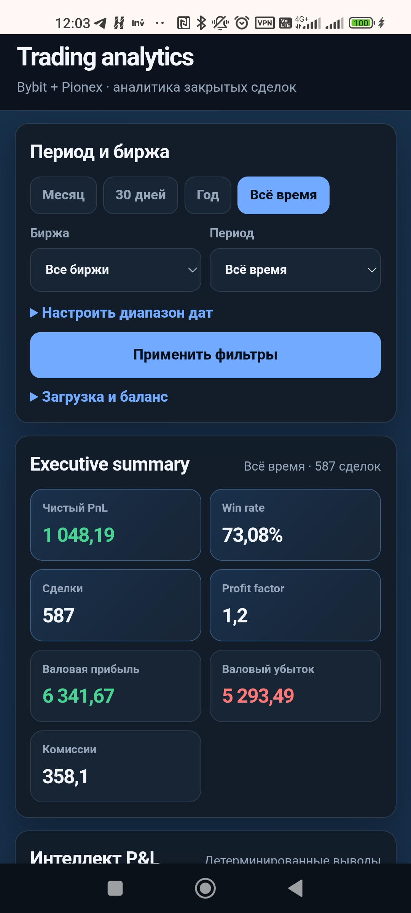
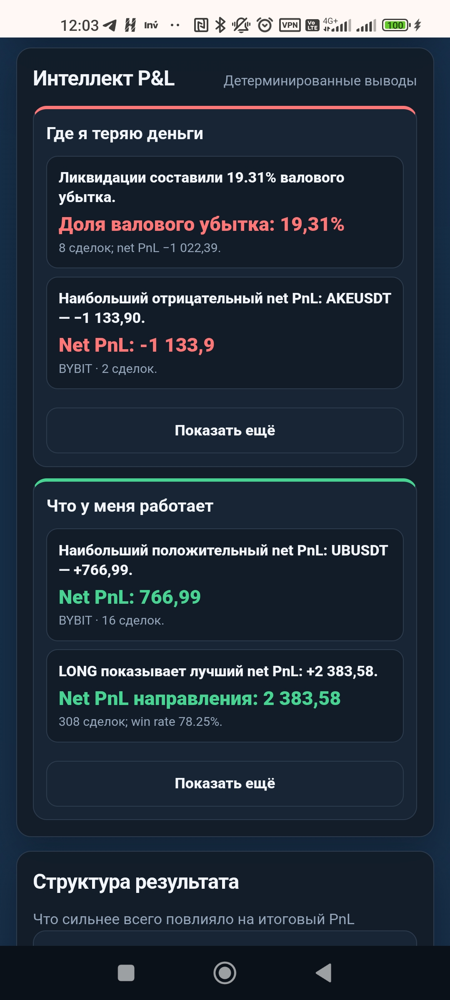
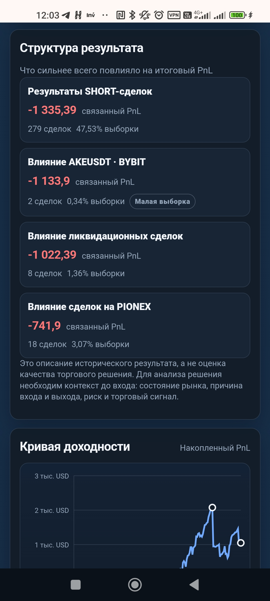
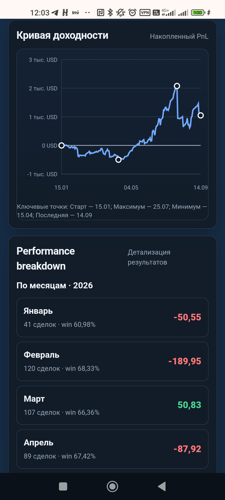
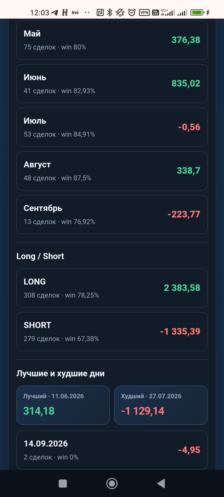

# Trade Performance Dashboard

> Evidence-based post-trade analytics for real trading history

Trade Performance Dashboard — веб-панель для разбора уже закрытых сделок. Это не торговый бот и не просто PnL tracker: сервис показывает не только, сколько было заработано или потеряно, но и какие группы исторических сделок сформировали итоговый результат.

## Что это

Это evidence-based слой персональной post-trade аналитики. Он работает с фактической историей закрытых сделок, приводит данные поддерживаемых бирж к единой модели и помогает исследовать результат выбранного периода: по направлениям, инструментам, биржам, комиссиям, ликвидациям и другим срезам.

## Проблема

Общий PnL скрывает структуру результата. Прибыльный или убыточный период сам по себе не объясняет, как на него повлияли LONG и SHORT, отдельные монеты, биржи, комиссии, ликвидации или несколько крупных убытков. Но превращать такие наблюдения в торговые указания было бы столь же неверно: в истории сделок обычно нет полного контекста на момент входа.

## Решение

Dashboard импортирует историю закрытых сделок с поддерживаемых бирж, нормализует её в общую модель и рассчитывает детерминированную post-trade аналитику. Для выбранного исторического среза доступны KPI, разбивки, кривая доходности, Intelligence P&L и «Структура результата».



*Обзор — выбранный исторический срез, ключевые KPI и начало evidence-based анализа в адаптивном интерфейсе.*

## Что умеет

- Работает с историей закрытых сделок Bybit и Pionex.
- Показывает число сделок, Win rate, валовый и чистый PnL, комиссии, Profit factor, средний выигрыш/убыток и метрики ликвидаций.
- Показывает последний доступный снимок equity и ROI, если для биржи доступен снимок баланса.
- Поддерживает пресеты периода, произвольный диапазон дат и фильтры по бирже; в списке сделок — также по символу и категории.
- Выявляет наблюдения «Где я теряю деньги» и «Что у меня работает» для выбранной истории.
- Строит исторические сценарии по ликвидациям, направлению, бирже, группе монет, концентрации убытков и комиссиям — когда для этого есть данные.
- Показывает кривую доходности и разбивки по дням, месяцам, годам, направлениям и монетам.
- Имеет адаптивный web-интерфейс и HTTP API для тех же данных.

## Интеллект P&L

Для выбранных периода и бирж движок агрегирует нормализованные закрытые сделки по таким измерениям, как направление, биржа и символ. Так формируются детерминированные наблюдения о группах, связанных с убытками и сильными результатами.

Здесь нет runtime LLM analytics: цифры и выводимые наблюдения рассчитываются по сохранённым историческим полям. Генеративная модель не интерпретирует числа и не создаёт торговые советы.

## Структура результата

«Структура результата» помогает отделить три разных уровня утверждений:

1. **FACT** — наблюдаемый исторический результат. Например: LONG-сделки в выбранной истории дали определённый чистый PnL.
2. **COUNTERFACTUAL HISTORICAL SCENARIO** — пересчёт той же истории так, как если бы выбранной группы уже закрытых сделок в ней не было.
3. **CAUSAL / DECISION INTERPRETATION** — вывод о том, стоило ли совершать, избегать или менять решение.

Текущая версия реализует первые два уровня и не делает третий. Для него не хватает полного контекста до входа в сделку: состояния рынка, исходной гипотезы, сигнала, риск-плана, условий выхода и рыночного режима. Поэтому историческая связь не является торговой рекомендацией.

**Фактический исторический чистый PnL** — зарегистрированный чистый результат выбранного среза.

**Гипотетический исторический чистый PnL** — описательный пересчёт этого же среза без заданной группы закрытых сделок. Разница — это арифметическое изменение двух исторических итогов, а не прогноз.

### Уровни Confidence

Confidence отражает только размер затронутой исторической выборки, а не статистическую значимость:

| Confidence | Затронутые закрытые сделки |
| --- | ---: |
| LOW | 1–4 |
| MEDIUM | 5–19 |
| HIGH | 20+ |

Это ориентир по числу сделок, стоящих за наблюдением. Статистическая значимость в приложении не рассчитывается.

## Кривая доходности и Performance breakdown

Кривая доходности показывает накопительный исторический чистый PnL. Performance breakdown дополняет её разбивками по месяцам, годам, дням, направлениям и монетам, чтобы общий итог можно было изучать в разных срезах.

## Поддерживаемые биржи

- **Bybit:** импорт закрытого PnL и снимка баланса аккаунта.
- **Pionex:** импорт истории позиций; при доступности используются данные исполнений и funding для обогащения записей, а также снимок баланса.

Клиенты бирж используют операции чтения поддерживаемой истории и баланса. В приложении нет логики размещения или отмены ордеров. История нормализуется и сохраняется в базе приложения, но сделки не исполняются.

## Как это работает

```text
Bybit / Pionex
       |
       v
Адаптеры импорта и сервисы синхронизации
       |
       v
Нормализация в записи закрытых сделок
       |
       v
PostgreSQL
       |
       v
Движок аналитики
  ├─ KPI и разбивки
  ├─ Intelligence P&L
  ├─ counterfactual historical scenarios
  └─ кривая доходности
       |
       v
FastAPI analytics endpoints → web dashboard
```

Краткое техническое описание доступно в [docs/architecture.md](docs/architecture.md).

## Скриншоты / Демонстрация

Ниже — пять снимков приложения на анонимизированном историческом срезе. Это подтверждение реализованных экранов, а не прогнозы и не торговые рекомендации. Состав снимков и checklist приватности — в [docs/screenshots/README.md](docs/screenshots/README.md).



*Intelligence P&L — детерминированные наблюдения о связанных с убытками группах и сильных результатах в выбранной истории закрытых сделок.*



*Структура результата — исторический состав чистого PnL, включая число затронутых сделок и контекст размера выборки.*



*Кривая доходности и разбивка — накопительный исторический чистый PnL и помесячная динамика.*



*Performance breakdown — помесячные результаты, сравнение направлений и заметные дневные исторические результаты.*

Демонстрационное видео намеренно не добавляется в Git. Публичная ссылка на него пока не предоставлена и остаётся обязательным TODO в [docs/contest.md](docs/contest.md).

## Ограничения

- Это post-trade аналитика, а не полная запись контекста принятия решения до сделки.
- Историческая связь не доказывает причинность.
- Counterfactual historical scenario не является прогнозом или торговым сигналом.
- Уровни Confidence — это диапазоны размера выборки, а не статистическая значимость.
- Записи Pionex пропускаются, если по исходным данным нельзя получить явное направление, ненулевой размер или пригодные цены входа и выхода.

Подробности — в [docs/LIMITATIONS.md](docs/LIMITATIONS.md).

## Роль AI в разработке

AI/Codex использовался как инженерный помощник при анализе проекта, разработке, рефакторинге, проверке логики, тестировании, улучшении UI/UX и подготовке документации.

Runtime-аналитика проекта детерминированная и evidence-based: отображаемые показатели и исторические сценарии вычисляются по сохранённым данным сделок, а не поручаются генеративной модели.

## Безопасность

Храните учётные данные вне репозитория и выдавайте API-ключам бирж только минимально необходимые права чтения. Не публикуйте идентификаторы аккаунтов, сделок и ордеров, сырые ответы API, ключи, токены, cookies или инфраструктурную конфигурацию в скриншотах и демонстрациях. Подробнее — в [SECURITY.md](SECURITY.md).

## Запуск

1. Создайте локальный файл окружения: `cp .env.example .env`.
2. При необходимости заполните в `.env` API-ключи бирж с правами только на чтение.
3. Запустите приложение и PostgreSQL: `docker compose up --build`.
4. После запуска откройте `http://localhost:8000`.

Контейнер приложения применяет миграции базы данных при старте. Для быстрой проверки доступны, в частности, `GET /health` и аналитические endpoints; точные параметры маршрутов описаны в `app/main.py`.

## Дальнейшее развитие

**Только возможное будущее развитие: PFI не реализован и не интегрирован.** Следующим этапом мог бы стать контекст до сделки:

```text
PFI: контекст до сделки → фактическая сделка → Trade Performance Dashboard
→ post-trade анализ результата → сопоставление исходной гипотезы и исхода
```

Такой контекст мог бы включать рыночный режим, funding/open interest, order flow, ликвидность, риск манипуляций, сигнал или доказательства для гипотезы и другие факторы до сделки. Только с ним проект мог бы двигаться к более полному Decision Intelligence.

## Конкурсная заявка

Краткая конкурсная презентация — в [docs/contest.md](docs/contest.md). Сценарий демонстрации на 2–3 минуты находится в [docs/DEMONSTRATION.md](docs/DEMONSTRATION.md). Ссылка на обязательное demo video будет добавлена в отмеченный placeholder после записи; в этом репозитории она пока не заявляется.

## Лицензия / повторное использование

В текущей версии репозитория отсутствует файл `LICENSE`. Этот README не заявляет open-source лицензию или разрешение на повторное использование.
